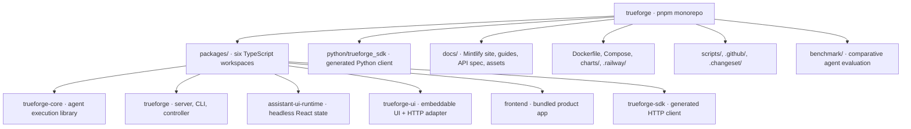
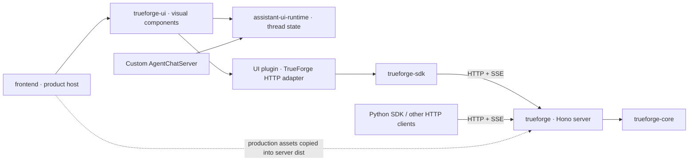
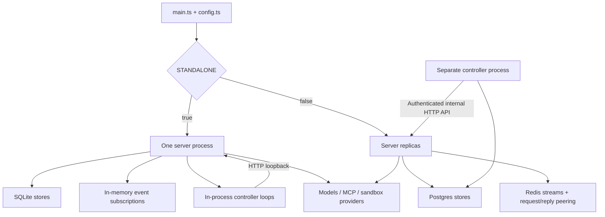
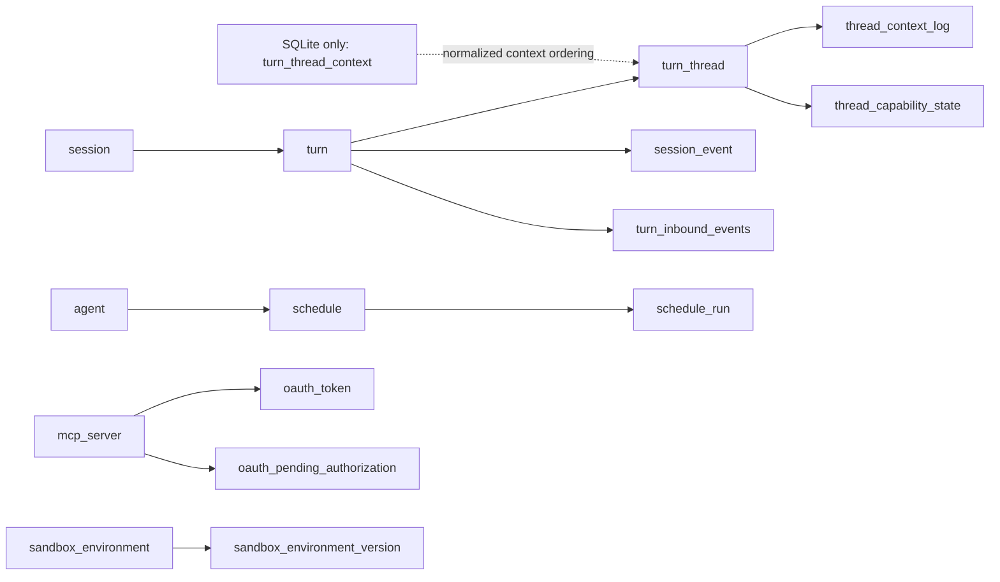
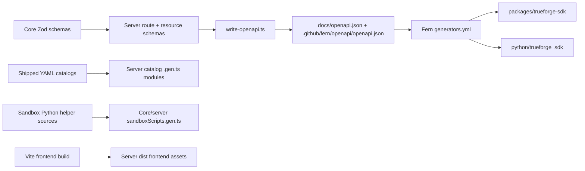

# TrueForge repository structure

This repository implements an agent harness: a model/tool execution library, a server with durable sessions and HTTP streaming, a headless React runtime, an embeddable UI, a bundled chat application, and generated TypeScript/Python API clients.

The source map below describes ownership and execution. The generated companion files cover every Git-tracked and non-ignored untracked file, including hidden configuration, assets, tests, migrations, and generated SDK internals. Ignored dependencies, build outputs, secrets, and local data are outside the inventory.

- [Complete directory and file tree](repository-tree.txt)
- [Extracted package manifests, scripts, dependencies, exports, API operations, database columns, and configuration keys](repository-reference.md)
- [Machine-readable file, module, import, and exported declaration inventory](repository-inventory.json)

Regenerate the companions with `pnpm repo:map` or `npm run repo:map`. Check freshness with `pnpm repo:map --check` or `npm run repo:map -- --check`. The architecture narrative is maintained separately; regeneration does not infer changes to runtime behavior.

## 1. Repository overview



| Root area                            | Responsibility                                                                                                                               | Source anchors                                                                               |
| ------------------------------------ | -------------------------------------------------------------------------------------------------------------------------------------------- | -------------------------------------------------------------------------------------------- |
| `packages/`                          | Six pnpm workspaces; five published packages and one private frontend                                                                        | [Workspace membership](../pnpm-workspace.yaml), [root commands](../package.json)             |
| `python/trueforge_sdk/`              | Fern-generated Python distribution, clients, types, errors, tests, transport helpers                                                         | [pyproject.toml](../python/trueforge_sdk/pyproject.toml)                                     |
| `docs/`                              | Mintlify MDX pages, API examples, UI SDK guides, images, brand and architecture assets                                                       | [docs.json](docs.json), [UI SDK guide index](ui-sdk/README.md)                               |
| `charts/trueforge/`                  | Helm server/controller deployments, Service, autoscaling, PDB, service account and extra objects                                             | [Chart.yaml](../charts/trueforge/Chart.yaml), [values.yaml](../charts/trueforge/values.yaml) |
| `.railway/`                          | Hosted application, controller, database and Redis topology                                                                                  | [railway.ts](../.railway/railway.ts)                                                         |
| `.github/`                           | CI, releases, SDK generation, image scanning, deployments, CodeQL, issue templates and Fern configuration                                    | [Workflow inventory](repository-reference.md#ci-and-automation)                              |
| `scripts/`                           | Workspace cleaning, SDK generation, changesets, release/version preparation, migration ordering, package smoke checks and repository mapping | [Every script](repository-tree.txt)                                                          |
| `benchmark/`                         | Runs TrueForge, Claude Managed Agents and deepagents against a common task suite; grades and aggregates results                              | [Benchmark guide](../benchmark/README.md)                                                    |
| `.changeset/`                        | Release configuration and pending release notes                                                                                              | [Release guide](../RELEASING.md)                                                             |
| `.cursor/`, `AGENTS.md`, `CLAUDE.md` | Editor/agent guidance and scoped ownership rules                                                                                             | [Repository rules](../AGENTS.md)                                                             |
| Root configuration                   | Lockfile, package scripts, TypeScript settings, ESLint, Prettier, Husky, Docker ignore and Git ignore                                        | [Full root inventory](repository-tree.txt)                                                   |

The root rules mention `patches`, but there is no `patches/` directory in this checkout.

## 2. Package boundaries

| Directory                       | npm identity                                  | Ownership                                                                                                       | Entry points                                                                                    |
| ------------------------------- | --------------------------------------------- | --------------------------------------------------------------------------------------------------------------- | ----------------------------------------------------------------------------------------------- |
| `packages/trueforge-core`       | `@truefoundry/trueforge-core`                 | Agent execution, durable session contracts, provider abstractions and executor peering                          | `src/index.ts`, `src/core/index.ts`, `src/agent-session/index.ts`, `src/request-reply/index.ts` |
| `packages/trueforge`            | `@truefoundry/trueforge`                      | Executable product: CLI, HTTP server, persistence adapters, auth, controller, catalogs, static frontend serving | `src/cli.ts`, `src/main.ts`, `src/controller-main.ts`                                           |
| `packages/assistant-ui-runtime` | `@truefoundry/trueforge-assistant-ui-runtime` | Backend-independent React runtime and canonical UI-facing server ports/events                                   | `src/index.ts`, `src/server/index.ts`                                                           |
| `packages/trueforge-ui`         | `@truefoundry/trueforge-ui`                   | UI atoms, containers, layouts, slots, themes, routing and TrueForge HTTP adapter                                | `src/index.ts`, `src/assistant-ui.ts`, `src/plugins/trueforge-agent-server-adapter/index.ts`    |
| `packages/frontend`             | `frontend` (private)                          | Product boot, authentication screens and host branding around the UI SDK                                        | `index.html`, `src/main.tsx`, `src/App.tsx`                                                     |
| `packages/trueforge-sdk`        | `@truefoundry/trueforge-sdk`                  | Generated typed HTTP client and wire models                                                                     | `src/index.ts`; generated CJS/ESM distribution                                                  |

The complete **declared** workspace graph is generated from manifests in [repository-reference.md](repository-reference.md#declared-workspace-dependencies). The following diagram describes the functional layers; HTTP and SSE edges represent runtime communication, and frontend assets are copied at build time.



The assistant-ui runtime accepts an already constructed `AgentChatServer` and has no TrueForge backend SDK dependency. The UI package provides the concrete TrueForge adapter. Server ports and UI DTOs are owned by [assistant-ui-runtime/src/server/types.ts](../packages/assistant-ui-runtime/src/server/types.ts) and [events.ts](../packages/assistant-ui-runtime/src/server/events.ts); [trueforge-ui/src/server/types.ts](../packages/trueforge-ui/src/server/types.ts) re-exports those contracts.

## 3. Core library internals

```text
packages/trueforge-core/
├── src/
│   ├── index.ts                    root namespaces
│   ├── core/
│   │   ├── runtime/                agent thread loop, orchestrator, snapshots, metrics
│   │   ├── llm/                    model contract, Vercel AI adapter, message/usage conversion
│   │   ├── mcp/                    remote/local tools, tool selection, execution, pagination
│   │   ├── capabilities/           capability/context/response processor contracts
│   │   │   └── builtins/           questions, compaction, date/time, subagents, OpenUI, search
│   │   ├── sandbox/                lazy sandbox, providers, code mode, skills, Python helpers
│   │   ├── events/                 core event schemas and passthrough events
│   │   ├── tracing/                tracing contract and no-op implementation
│   │   ├── web-search/             search provider contract and Parallel implementation
│   │   └── util/                   abort/error/promise helpers and SSRF guard
│   ├── agent-session/
│   │   ├── Sessions.ts             session service over ISessionStore
│   │   ├── SessionHandle.ts        bound session; starts/resumes/forks turns
│   │   ├── TurnHandle.ts           execution, durable writes and streamed events
│   │   ├── TurnResourceResolver.ts model/MCP/skills/sandbox/agent resolution
│   │   ├── models/                 persistence records
│   │   ├── schemas/                agent/session/turn/event/subject/pagination contracts
│   │   └── store/                  canonical store port, errors, pagination, in-memory store
│   └── request-reply/              Redis client/executor/router, heartbeats and replies
├── tests/                          package-top-level mirrored tests
└── scripts/                        sandbox helper embedding and dist validation
```

`AgentThread` runs the model/tool loop; `AgentThreadOrchestrator` coordinates the root thread and subagents. `SessionHandle` prepares the execution from session state, previous turn and incoming input. `TurnHandle.stream()` executes once, persists durable events/state, and exposes streaming output. Token deltas pass through without being stored as durable events.

The core runtime yields durable changes before changing its in-memory state, allowing the session layer to persist them first. This boundary is required by [core/runtime/AGENTS.md](../packages/trueforge-core/src/core/runtime/AGENTS.md). Store APIs and their test/CI requirements are governed by [agent-session/store/AGENTS.md](../packages/trueforge-core/src/agent-session/store/AGENTS.md).

Provider implementations in the checkout include Vercel AI-backed model providers, remote MCP servers, Daytona/TrueFoundry sandboxes, code-mode transport over NATS, and Parallel web search. Local sandbox support is implemented in the server package, which supplies it through the core provider contract.

## 4. Server internals and request flow

```text
packages/trueforge/
├── src/
│   ├── cli.ts / main.ts            CLI launcher; server composition and lifecycle
│   ├── app.ts                      HTTP app, middleware, router mounts, OpenAPI
│   ├── config.ts                   centralized typed environment configuration
│   ├── frontend.ts                 production UI assets, compression, base-path handling
│   ├── auth/                      standalone/OIDC auth, cookies, claims, authorization
│   ├── routes/                    HTTP method/path/request/response declarations
│   ├── apis/                      handlers and sub-router composition
│   ├── schemas/                   server-owned resource and HTTP schemas
│   ├── db/                        store contracts, transactions, migrations and adapters
│   │   ├── postgres/              Kysely/pg stores, queries, schema, migrations
│   │   └── sqlite/                better-sqlite3 stores, queries, types, migrations
│   ├── runtime/                   active turns, resource resolution, event subscriptions
│   ├── controller/                schedules and sandbox environment build loops
│   ├── sandbox/                   environment lifecycle, provider wiring, local sandbox
│   ├── catalog/                   typed loaders for shipped YAML catalogs
│   ├── mcp/                       OAuth authorization and token persistence
│   ├── truefoundry/                token-bound external stores, policies and gateway metadata
│   ├── http/                      server TLS support
│   ├── sentry/                    error reporting setup
│   └── websearch/, utils/, util/  provider wiring and shared server utilities
├── catalog/                       model/MCP/skill/sandbox/web-search YAML presets
├── tests/                         unit, database, runtime, auth, API and sandbox coverage
├── scripts/                       catalogs, local sandbox embedding, OpenAPI and assets
└── tsup.config.ts                 server/CLI/controller/migration bundle entries
```

```mermaid
sequenceDiagram
  participant Client as UI adapter / SDK / HTTP client
  participant App as Hono app + auth
  participant API as apis/turns.ts
  participant Session as SessionHandle
  participant Turn as TurnHandle
  participant Loop as AgentThreadOrchestrator / AgentThread
  participant Provider as Model / MCP / sandbox
  participant Store as ISessionStore adapter
  Client->>App: POST /api/v1/sessions/{session_id}/turns
  App->>API: validate request and authorize caller
  API->>Session: createTurn + per-turn resource resolver
  Session->>Store: create turn and restore/initialize thread state
  Session-->>API: TurnHandle
  API->>Turn: drain stream()
  Turn->>Loop: execute
  Loop->>Provider: model calls and tools
  Provider-->>Loop: tokens / results / required actions
  Loop-->>Turn: execution events
  Turn->>Store: persist durable events and state
  Turn-->>API: stream events; token deltas pass through
  API-->>Client: resumable SSE event stream
```

`main.ts` selects persistence, authentication, resource stores, the active-turn registry, event subscription registry and executor peering. `app.ts` receives these dependencies and builds the HTTP app. The turn API resolves providers and calls the core session layer; the server owns transport, authorization and process lifecycle.

See [apis/turns.ts](../packages/trueforge/src/apis/turns.ts), [runtime/sessionResources.ts](../packages/trueforge/src/runtime/sessionResources.ts), [SessionHandle.ts](../packages/trueforge-core/src/agent-session/SessionHandle.ts) and [TurnHandle.ts](../packages/trueforge-core/src/agent-session/TurnHandle.ts).

### HTTP surface

| Mount                                              | Responsibility                                                                        |
| -------------------------------------------------- | ------------------------------------------------------------------------------------- |
| `/healthz`                                         | Process health and package version                                                    |
| `/api/v1/auth`                                     | Browser authentication, session identity and logout                                   |
| `/api/v1/models`, `/api/v1/catalogs`               | Available models and preset catalogs                                                  |
| `/api/v1/mcp-servers`, `/api/v1/mcp-servers/oauth` | Configured tool connectors and OAuth                                                  |
| `/api/v1/skills`, `/api/v1/capabilities`           | Available skills and feature availability                                             |
| `/api/v1/agents`                                   | Agent registry, manifests and related operations                                      |
| `/api/v1/sessions`                                 | Sessions, turns, events, subscriptions and sandbox downloads                          |
| `/api/v1/schedules`                                | Scheduled tasks and run history                                                       |
| `/api/v1/sandbox-environments`                     | Versioned sandbox environments                                                        |
| `/api/v1/settings/*`                               | Admin model/MCP/skill/sandbox/web-search configuration                                |
| `/api/internal/*`                                  | Schedule execution, environment builds, import, session/metrics/permission operations |
| `/api/v1/docs`, `/api/v1/openapi.json`             | Optional Swagger UI and served specification                                          |

This is a mount overview. Every operation in the committed specification is listed in [repository-reference.md](repository-reference.md#http-api). Internal routing and conditional routes should be checked against `app.ts` and `apis/`. The frontend README's statement that turn subscription is unregistered is stale: `apis/turns.ts` registers `subscribeTurnRoute` in this checkout.

## 5. Persistence and runtime topologies



Both modes use the same core `ISessionStore` contract. The server implements separate SQLite and Postgres adapters; core also provides an in-memory store for embedding/tests. Redis carries resumable live event transport and cross-replica executor communication in hosted mode; durable session state remains in the database.

Authentication selection is separate from storage mode: the server chooses standalone, OIDC or TrueFoundry authentication. TrueFoundry integration supplies selected resource stores and authorization against ServiceFoundry while retaining local persistence responsibilities. See [main.ts](../packages/trueforge/src/main.ts), [auth/createAuthenticator.ts](../packages/trueforge/src/auth/createAuthenticator.ts), and [truefoundry/](../packages/trueforge/src/truefoundry/).

### Data model



Arrows show logical ownership/reference relationships; this is not a declaration that every edge is a physical foreign key. The schemas and migrations define physical constraints.

| Table family           | Tables                                                                                      | Purpose                                                                                       |
| ---------------------- | ------------------------------------------------------------------------------------------- | --------------------------------------------------------------------------------------------- |
| Execution              | `session`, `turn`, `turn_thread`, `session_event`, `turn_inbound_events`                    | Session metadata, turn states, thread checkpoints, durable outgoing events and incoming inbox |
| Context                | `thread_context_log`, `thread_capability_state`; SQLite also `turn_thread_context`          | Immutable context content, ordered context references and per-turn capability state           |
| Resource configuration | `model_provider`, `web_search_provider`, `skill`, `sandbox_provider`, `agent`, `mcp_server` | Tenant-scoped configured resources and agent manifests                                        |
| Sandbox environments   | `sandbox_environment`, `sandbox_environment_version`                                        | Environment identity, active version, build status and external references                    |
| Scheduling             | `schedule`, `schedule_run`                                                                  | Cron/task configuration and pending/historical runs                                           |
| OAuth                  | `oauth_token`, `oauth_pending_authorization`                                                | Per-user connector tokens and authorization callback state                                    |

Postgres holds context ordering in `turn_thread.context_ids`; SQLite uses `turn_thread_context`. The two backends therefore have related contracts and deliberately different physical representations. The full directly declared table columns and migration counts are extracted in [repository-reference.md](repository-reference.md#database-tables-and-columns).

## 6. UI layers

```text
packages/frontend/src/
  main.tsx → App.tsx → auth gate + boot configuration → TrueForgeUI
  authFetch.ts / authSession.ts / authStatusSearch.ts
  publicPath.ts / welcome/error/logout screens / host styles

packages/trueforge-ui/src/
  containers/     stateful composition: chat, approvals, agent/setting builders
  atoms/          presentational pieces, primitives, agent details, schedules, adapters
  layouts/        sidebar, dock, drawer, widget, stack chat
  routing/        URL/session synchronization and shared-session boot
  server/         resolved server context, shell capabilities, session-list cache
  plugins/       trueforge-agent-server-adapter: HTTP client ↔ UI contracts
  theme/         providers, public slots, defaults, presets, brand and style injection
  hooks/         approvals, composition, sharing, instructions and UI state
  filePreview/   preview loading/state and pane sizing
  contexts/      current user
  icons/         registry and shipped icons
  utils/         metrics, timelines, pagination, links and display conversion

packages/assistant-ui-runtime/src/
  server/        canonical chat/builder/catalog ports, DTOs and stream events
  draft/         inline agent spec and draft-session bridge
  useTrueForgeAgentRuntime.ts / useTrueForgeAgentMessages.ts
  thread-list adapters / session snapshots / stream folding / message conversion
  approvals / required-action input / MCP auth / downloads / attachments / extras
```

Visual atoms receive props; containers connect runtime state to those atoms. Slot overrides and theme providers customize presentation. Routing, settings catalogs and the built-in HTTP adapter live in the UI SDK. `frontend` supplies the product's auth-aware fetch, initial configuration and chrome. See [UI architecture](../packages/trueforge-ui/docs/architecture.md), [runtime README](../packages/assistant-ui-runtime/README.md), and [frontend App.tsx](../packages/frontend/src/App.tsx).

## 7. Generated code and build pipeline



SDK code and both OpenAPI copies are generated and must not be manually edited. [scripts/generate-sdk.sh](../scripts/generate-sdk.sh) and [.github/workflows/generate-sdk.yaml](../.github/workflows/generate-sdk.yaml) define the regeneration path; [.github/fern/generators.yml](../.github/fern/generators.yml) configures the client generators.

Root `build` order is **core → TypeScript SDK → assistant-ui runtime → UI SDK → frontend → server**. The frontend builds with Vite; the server copies frontend assets and emits the CLI, server, controller and both sets of migration modules. The core emits CJS/ESM and declarations and validates its dist layout.

Host development resolves core/SDK source through the `trueforge-dev` export condition. SDK runtime code resolves to `src/`, while its type branch remains on generated declarations emitted by root `sdk:types`. Published consumers use the packed dist exports. These are release requirements in [AGENTS.md](../AGENTS.md), with generator configuration in [.github/fern/generators.yml](../.github/fern/generators.yml).

## 8. Development, testing, deployment and releases

| Workflow               | Entry command / owner                                                            | What it connects                                                          |
| ---------------------- | -------------------------------------------------------------------------------- | ------------------------------------------------------------------------- |
| Standalone development | `pnpm standalone:dev`                                                            | Vite on 3000, API on 8790, SQLite, generated source helpers               |
| Hosted development     | `pnpm dev:infra`, then `pnpm dev`                                                | Host API/controller/frontend with Compose Postgres and Redis              |
| Production build       | `pnpm build`                                                                     | All six packages in dependency order; frontend inside server distribution |
| Static analysis        | `pnpm format:check`, `pnpm typecheck`, `pnpm lint:ci`                            | Workspace formatting, package types and lint                              |
| Package tests          | `pnpm test` and root `test:*` scripts                                            | Core/server Jest; runtime/UI Vitest; frontend auth tests                  |
| Persistence contracts  | `pnpm test:store:local`, `test:store:postgres`, `test:store:sqlite`              | Mirrored store behavior across Postgres and SQLite                        |
| Local sandbox checks   | `test:local-sandbox:contract`, `smoke:local-sandbox`, `smoke:local-sandbox:lima` | Local sandbox behavior and execution environment                          |
| Full-stack smoke       | `pnpm smoke`                                                                     | Compose server/controller/Postgres/Redis, health and UI on host 8791      |
| Packed CLI smoke       | `pnpm smoke:npx`                                                                 | Built package and installed CLI behavior                                  |
| Helm                   | `pnpm chart:deps`, `chart:lint`, `chart:template`, `chart:package`               | Kubernetes packaging and manifest checks                                  |
| SDK regeneration       | `pnpm sdk:generate`                                                              | OpenAPI, TypeScript/Python clients, generated verification                |
| Releases               | Changesets, `pnpm version`, release workflows                                    | Versioning, package/image publication and chart release                   |

All package scripts, dependency ranges, export conditions and root commands are reproduced from manifests in [repository-reference.md](repository-reference.md).

`docker-compose.dev.yml` provides only host development infrastructure; `docker-compose.yml` runs the full hosted stack. Both use Postgres 17 and Redis 7 Alpine with synchronized infrastructure health checks. The full stack overrides host `.env` connectivity to use Compose DNS names. Their host ports, app services, project names and volume paths deliberately differ.

[Dockerfile](../Dockerfile) builds from source; [Dockerfile.npm](../Dockerfile.npm) installs the published package. [charts/trueforge/](../charts/trueforge/) and [.railway/railway.ts](../.railway/railway.ts) deploy hosted server/controller topologies. The sandbox image is built from [trueforge-core/scripts/sandbox/sandbox.Dockerfile](../packages/trueforge-core/scripts/sandbox/sandbox.Dockerfile).

[ci.yml](../.github/workflows/ci.yml) coordinates shared gates, per-package test selection, store checks and chart checks. Other workflows cover SDK generation, npm/container releases, chart releases, sandbox image publishing, dev/test deployment approval, image scanning and CodeQL. [repository-reference.md](repository-reference.md#ci-and-automation) lists every workflow file.

Changes to published packages or the bundled frontend require a changeset. Tests belong in package-top-level `test/` or `tests/` directories. Contract/schema changes must update their affected consumers; ownership and scoped rules are listed in the full file tree. This mapping change adds documentation and a root tooling script without modifying published package code.

## 9. Reading paths and extraction limits

| To understand…         | Follow…                                                                                                                     |
| ---------------------- | --------------------------------------------------------------------------------------------------------------------------- |
| Product startup        | `trueforge/src/cli.ts` → `config.ts` → `main.ts` → `app.ts`                                                                 |
| One agent turn         | `trueforge/src/apis/turns.ts` → core `SessionHandle.ts` → `TurnHandle.ts` → `AgentThreadOrchestrator.ts` → `AgentThread.ts` |
| Persistence            | core `ISessionStore.ts` → server Postgres/SQLite store implementations → query modules → migrations/types                   |
| Chat rendering         | frontend `App.tsx` → UI `TrueForgeUI.tsx` → containers/atoms → assistant-ui runtime                                         |
| Client/backend mapping | UI `plugins/trueforge-agent-server-adapter/` → generated TypeScript SDK → server route definitions/handlers                 |
| Scheduling/build loops | `controller-main.ts` / standalone `main.ts` → `controller.ts` → `controller/scheduleDispatch.ts` / `sandboxEnvBuild.ts`     |
| Generated clients      | server route/core schemas → OpenAPI writer → Fern config → TypeScript/Python SDK                                            |
| A particular module    | Search its path in `repository-tree.txt`; look up its imports/exports in `repository-inventory.json`                        |

The inventory is a source-structure snapshot, not a proof of runtime reachability. Manifests and committed OpenAPI are parsed directly. Imports, literal mounts, database interface members and named exported declarations use text scans; computed imports, wildcard export expansion, semantic TypeScript resolution, Python module resolution and call graphs are not inferred. Best-effort module targets can omit generated or conditionally exported files. The committed OpenAPI can lag source changes; source registration remains authoritative for the running server.
